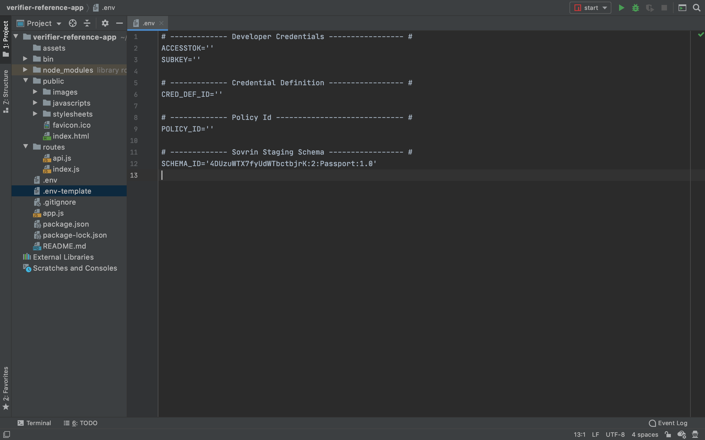
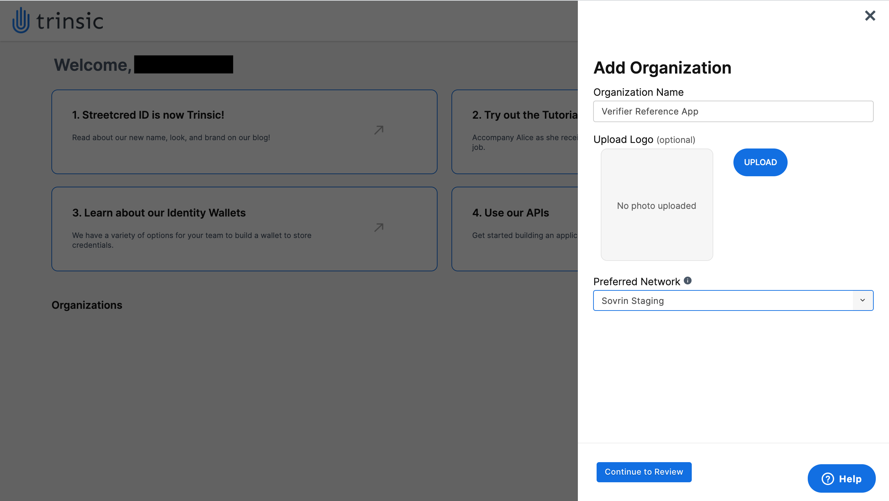
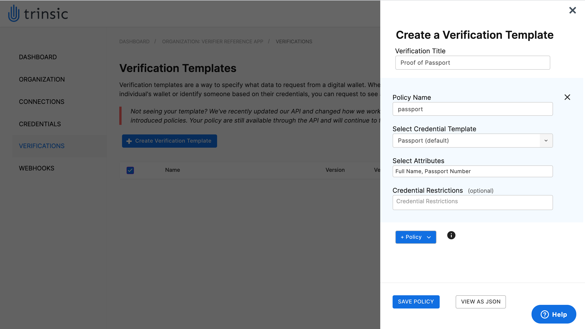
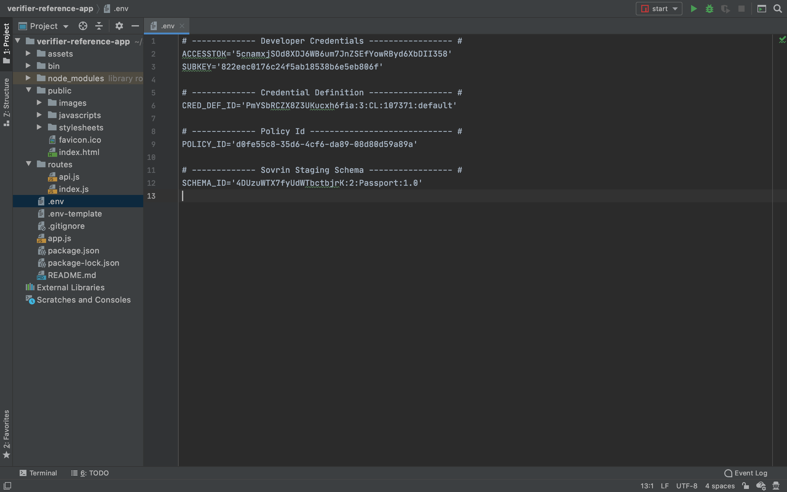
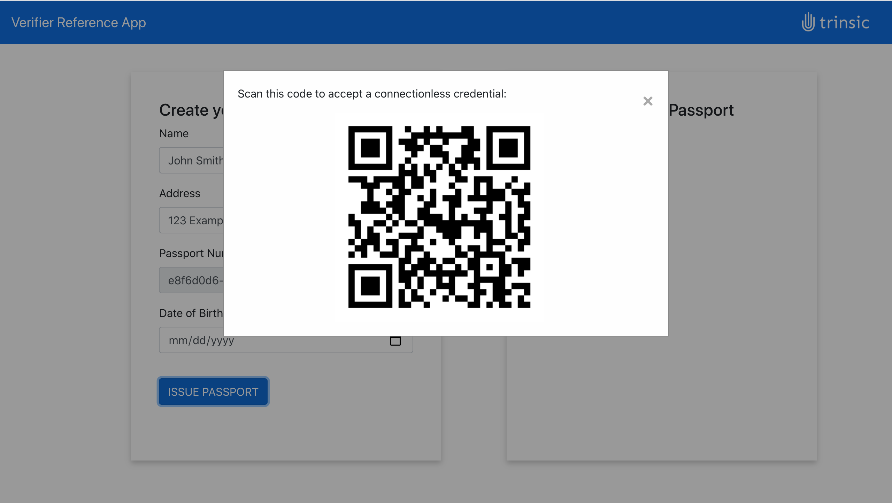
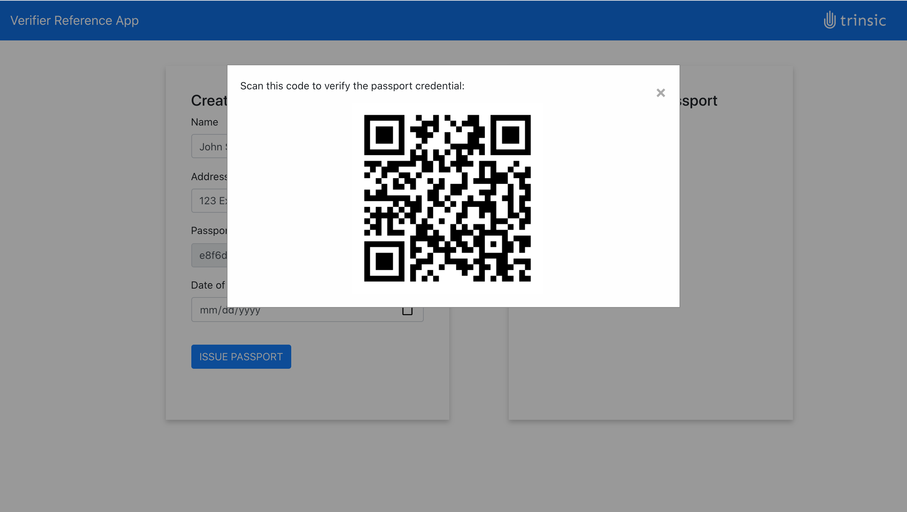
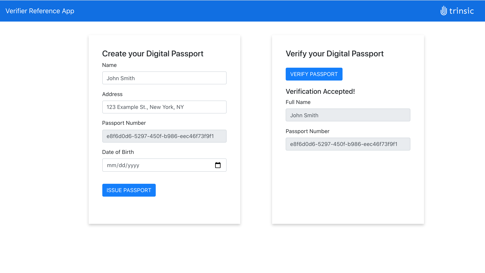

# Trinsic's Verifier Reference App
This demo shows how to issue a connectionless credential and request a connectionless verification.
It is a Node.js Express app which makes Trinsic Credential API calls with our service client.

## Use Case
This sample is to simulate a request of proof of a passport.
In order to provide a passport for the sample, there is also a simple issuer function that issues a connectionless passport credential.

## Prerequisites:
- [npm](https://www.npmjs.com/get-npm)
- The Trinsic Wallet app. Download the [Android](https://play.google.com/store/apps/details?id=id.streetcred.apps.mobile) or [iOS](https://apps.apple.com/us/app/trinsic-wallet/id1475160728) version for free and set up an account

## Setup 

### Download project and install dependencies 
 1. Clone the repository
 `git clone https://github.com/streetcred-id/verifier-reference-app`
 2. Navigate into the directory
 `cd verifier-reference-app`
 3. Install the dependencies
 `npm install`
 4. Open up the project in a code editor of your choice
 5. Rename the `.env-template` file to `.env`
 
 
### Configure your organization
 1. Go to <a href="https://studio.trinsic.id" target="_blank">Trinsic Studio</a> and login or create an account.
 2. Click the **+ Organization** button to slide out the **Add Organization** slider.
 3. Enter an organization name and make sure that the **Preferred Network** dropdown is set to "Sovrin Staging".
 
 4. Click the **Continue to Review** button and then click on **Confirm** to create the organization.
    - It might take a few seconds to create the organization. Just wait for it to finish.
 5. Click on the organization tile to go to the Organization View and retrieve the Access Token and Subscription Key from the tile on the right.
 6. In the .env file, add your organization's Access Token to the `ACCESSTOK` field.
    
### Define a credential
 1. Click on the **Credentials** tab on the left sidebar to navigate to the Credentials View.
 2. Click on the **+ New credential template** button to slide out the **Create a Credential Template** slider.
 3. Select the **From existing schema** radio button and enter a Credential Name.
 4. In the .env file, copy the `SCHEMA_ID` value and paste it into the **Schema ID** text box.
 
 5. Click the **Create Template** button to define the credential.
    - It might take a few seconds to define the credential. Just wait for it to finish.
 6. In the .env file, add the credential's Definition ID to the `CRED_DEF_ID` field.
 
### Define a verification
1. Click on the **Verifications** tab on the left sidebar to navigate to the Verifications View.
2. Click on the **+ Create verification template** button to slide out the **Create a Verification Template** slider.
3. Enter a Verification Title.
4. Click the **+ Policy** button and select "Attribute" to add an Attribute Policy to the verification template.
5. Enter "passport" as the Policy Name, select "Passport (default)" as the Credential Template, and select both "Full Name" and "Passport Number" as attributes.

6. Click the **SAVE POLICY** button to create the verification proof.
    - It might take a few seconds to define the verification proof. Just wait for it to finish.
7. In the .env file, add the verification's Verification ID to the `POLICY_ID` field.
8. Your .env file should now be completely filled out.

## Run the web app
 
### Start and use the application
1. Run with npm.
`npm start`
2. Open the web app on <a href="http://localhost:3000" target="_blank">localhost:3000</a>, and fill in the desired passport information.

3. Click **ISSUE PASSPORT**.
4. Using the Trinsic Wallet mobile app, scan the QR code that pops up and accept the offered credential.

5. Close the QR code modal and click **VERIFY PASSPORT** to begin the verification process.
6. Within 60 seconds, use the Trinsic Wallet mobile app to scan the QR code that pops.
    - If you take longer than 60 seconds to scan the verification QR code, the verification will time out and close.

7. On the Trinsic Wallet mobile app, present the desired information.
8. In the web app, the QR code modal will close, and the verified information will be displayed.

> Contact <support@trinsic.com> for any questions. 
